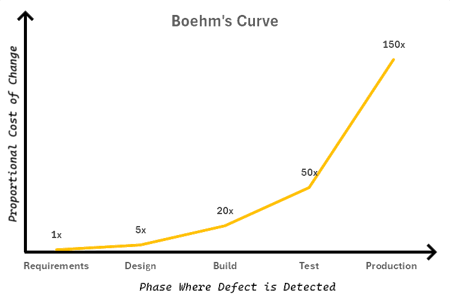

# About me

My name is Jaime Gonzalez, and as a **researcher and algorithm engineer**, my main goal is always to _understand_ the logic of anything.
Any software I develop I use Python (primary language) or Rust (secondary language).

## Algorithmic Philosophy

Every written code is not something that "just needs to work".
For me, every piece of software is required based on a **real need**.
That need will most likely evolve in the future, not just disappear.
For that reason, I have a set **mindset rules** whenever I create magic:

### 1. Understand the issue

Before coding, I always dive into understanding the problem and how to solve it.
A basic understanding is not enough for me, as in many cases a "simple solution" is actually entangled with other modules at the same project.
As a teacher once said to me: _"Coding starts on the paper, not at the keyboard"_.

!!! quote
    _"If you can't explain it to a six-year-old, you don't understand it yourself."_
    — Albert Einstein

### 2. Plan an implementation

I believe it is impossible to forsee all complications that any challenge will bring.
Nonetheless, that is no valid argument to start coding without a plan.
Those projects that continue coding on top of what there was without a clear vision are those that become unmaintainable and/or fail.

A good planning starts by defining all the required parts to solve the issue.
It does not matter that those parts might be composed of other smaller parts, as in that situation more planning would come (but only for a small specific section).
And several times the project might need to rectify, but these moments can be easily identified if the previous plan was prepared.

!!! quote
    _"The cost of finding and fixing a software error increases exponentially with time."_
    — Barry Boehm

### 3. Clean and readable code

Often, after applying a solution, people need to revisit the code to apply patches or completely modify the algorithm.
It does not matter how good someone is at coding, they will need to read that code again and understand it so they can work on it.
On top of that, if someone else needs to work on the same piece of code (and this is not readable), this can lead to the bad situation of completely deprecating code.

As my philosophy, I'd rather expend 15% more time creating good, clean and documented code while creating it than 30% of the time understanding what it was written every time that I revisit it.
Specially, when working with a team understanding is crucial.
I mostly follow the [_Google Coding Style Guides_](https://google.github.io/styleguide/), which can be simplified into:

- Define docstrings at every object/function.
- Use clear variable names and not just `i` or `j`.
- Clear workflows are better than faster workflows (specially when it improves only a fraction of a nanosecond per run).

!!! quote
    _"Any fool can write code that a computer can understand. Good programmers write code that humans can understand."_
    — Martin Fowler

### 4. Optimized workflow

The idea of _"Clean code"_ does not only mean that is readable, but that is also works at a proper speed.
Many times, resources are not being used correctly because the person most likely did not take the time to optimize afterward implementing the algorithm.

In my opinion, a good code has to be reactive enough for anyone to believe it works as if it were a Real Time System (RTS).
It is only in those sections where the "fast" code becomes incomprehensible where it must be written with the steps mentioned at [#3](#3-clean-and-readable-code).

!!! quote
    _"Premature optimization is the root of all evil (or at least most of it) in programming."_
    — Donald Knuth

### 5. Sturdy unit-tests

Error is a human trait, impossible to avoid.
While coding, anyone might think that they have covered all possible cases, but this is only far away from the truth.
No matter what the code was about, users will always break it.

I can't stop users from braking it, but I always make this task as hard as possible for them with proper unit-tests.
These are the rules I follow to create any test:

- **Test parts individually**, even if they rely on other parts of the code. When I write that test I assume everything else works properly. Therefore, every part of the project must be tested individually.
- **Use random values**. This might not always be possible, but the user input will always be "random". Thus, testing random values will display cases were not taken in consideration. I am still amazed about how many cases I've seen that considered positive and negative numbers, but not the value 0.
- **Parametrization is the key** to keep a few functions that can cover the whole project.

> A QA engineer walks into a bar. 
He orders a beer. 
He orders 0 beers. 
He orders 99999999999 beers. 
He orders a lizard. 
He orders -1 beers. 
He orders a sfdeljknesv. 
 
The first real customer walks in and asks where the bathroom is. 
The bar bursts into flames.
