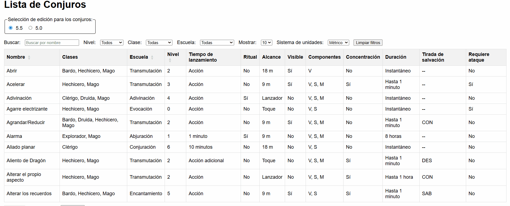

# DnD Spells Interactive Table

<div style="display: flex; justify-content: center">
<table>
    <tr>{{ get_table_headers("project") }}</tr>
    <tr>{{ load_project_table_data("DnD Spells Table (ES)") }}</tr>
</table>
</div>

This project wasn't my first project where I needed to create an HTML with simple CSS, 
but it was my first project where I chose to code in JavaScript.

My plan was to create a JSON database to be displayed at an HTML.
For that purpose, I took the strategy to ask AI to teach me one by one all the requirements I was looking for.
With that purpose, I created a table that allows:

- Selecting a specific version among two databases.
- Apply filters over the displayed data.
- Allow searching by name in real time.
- Selection of the units either in imperial or in the metric system.
- Present a simple UI, allowing to click over an item to display a new window with all expanded information.
- Not collect any information whatsoever from whomever uses it.



!!! hint
    Try the table [here](https://jtachan.github.io/DnD-5.5-Spells-ES/)

!!! note
    At the page, all attributions of every spell released at the SRD (_System Reference Document_) are given to _Wizards of the Coast_ under the terms of CC-BY-4.0.
    Any spell not released at the SRD was modified to not break the copyright license.

## Motivation

We all have our hobbies. One of mine is to play DnD (_Dungeons and Dragons_).
However, I was not able to find a free and fast tool that would allow players to quickly search DnD spells in real time.
There are many software tools, but they are either not fast, not free, loaded with adds or not in Spanish (my mother tongue).

Thus, I set my mind to create something:

- 100% free without collecting data
- Quick and clear to use
- Available from everywhere

## Project road

### 1. Defining database

The structure of the database was one of the main pillars for the project.
Creating a bad structure would resolve into expending a lot of time and effort at late stages of the project.

For that reason, I focused on finding all the general and important fields that people usually look at when reading a spell:

- **Basic fields**: Spell name, classes that can learn it, school of magic, components and spell level.
- **Numeric fields**: Reach when casting the spell, how long it remains, how long it takes to cast.
- **Useful 'flag' fields**: Can it be cast as a ritual? Does it require concentration?
- **Hidden information** (at the description): If the target needs to be visible, if the spell needs an attack throw.

Those named fields are general for all spells, no matter its effects.
Some other spells could use of extra information like '_damage_', but I decided to leave all this non-general information as the description of the spell.

### 2. Extracting data from the original text

The option of manually extracting all data into the structure defined at [#1](#1-defining-database) was never an option.
As I was on my own, I decided to ask the AI for help.

The instructions for the LLM chat were to:

- Extract all the data from an image, which would contain all the spell information.
- The data should be extracted in the previous fields. No additional fields should be provided.
- The description of the text should be in HTML displaying unordered lists and tables, unless the spell would not appear at the SRD.

Thanks to this strategy, I learned a strategy to work with absolutely any LLM:

- **Clarify all uncertainties** for the task to run. This avoids many undesired results. Do so by always allowing the LLM to ask you as many required questions as needed.
- **Define a specific prompt** ready to copy-paste and save it somewhere. This prompt should be as specific as possible, it helps to create it also with another LLM-chat.
- **Do not mix the cache among chats**. Consider each chat as a single worker that does not need to know from others. When they communicate, they will hallucinate sooner (as they will have access to the last piece of memory from another chat that hallucinated).
- Every chat **will hallucinate** sooner or later. At it, the best solution is **to eliminate that chat and create a new one**.
- Start **from simple to more complex**. For example, I always started each chat with a single image. Then, I would allow the agent to work over multiple images with multiple spells. This would return better results than just sending many pictures from the beginning.
- **Don't run many different tasks** on each chat. Each one should run a single very-well specified task to avoid early hallucinations.

!!! info
    This projects was enough for me to decide that LLMs are quite helpful for small repetitive tasks, but they are useless for working without surveillance at any-size project. 
    Please beware of using LLMs. They are a tool you should control and understand, not the other way around.

### 3. Imperial and metric systems

Once I had the data, I thought about supporting both systems: metric and imperial.
I honestly have played with both and there is no major issue with distances, but there is with large distances, areas or volumes.

Luckily, there is a **strong definition** among both systems due to the translation of the source to multiple languages.
More in detail, all maps are usually a grid where each square is 5 feet (imperial) or 1,5 meters (metric).

Finding the relation of all the possible measures, the conversion was applied with a **regex** using a Python script, that would search for a number followed by the unit.
The major inconvenience is that in Spanish at the metric system the decimals are _comma separated_ (like 1,5) and not _point separated_ (like 1.5).

```python
_METRIC_UNITS_REGEX = r"[kmc]?m|kg|l"
_IMPERIAL_UNITS_REGEX = r"pies?|pulgadas?|millas?|galón|galones|libras?"

METRIC_SYSTEM_REGEX = rf"((\d+,)?\d+) ({_METRIC_UNITS_REGEX})[\s.,]"
IMPERIAL_SYSTEM_REGEX = rf"((\d+,)?\d+) ({_IMPERIAL_UNITS_REGEX})[\s.,]"
```

This script would modify only two fields: the **distance** to cast the spell and the **description**.
Independent one from the other, the type of these fields were:

- `str`: In case they do not contain any measure in any system.
- `list of str`: List of two strings where the first was in imperial and the second in metric.

### 4. User support

Considering sections [#2](#2-extracting-data-from-the-original-text) and [#3](#3-imperial-and-metric-systems), I knew that everything that I did (without the support of anyone else) was prone to contain typos and/or errors.
I did revise each spell as I was defining all the data, but sometimes this was not going to be enough.

That is the reason for which I knew I had to allow users to send me some feedback.
As I like users to be anonymous, I was also interested in this feedback to reach me without them knowing my mail address and without me collecting any data from them.

The **solution** was to set a [Formspree](https://formspree.io/) form, which would collect just the written text of the users and would reach my mail address.
This is the yellow button that displays the text `"Reportat un error"` underneath the table.

### 5. Logic for the table

Once everything was in place, the logic for the table was quite straight forward:

1. All data would be loaded into the memory, as we are talking about JSON files of size around 800 kB.
2. Depending on the selected filters, a "filtered" array would hold all the final data to display.
3. Allow sorting through the name and the level (only once at the time).
4. Depending on a 'used system' flag, display measures in imperial or metric.
5. Display at the table only short information to see, then display the whole spell when the row is clicked.
