# Vehicle Model Predictor with 6-DoF
This was my Final **Bachelor's Degree Project** at the University of Alcalá de Henares.
In it, at the last page, it's all the external links and bibliography I used for research.

The **motivation** for the research is to find a mathematically accurate vehicle model, which can predict the 6 degrees of freedom (DoF) of a vehicle in motion.
With it, the model could help at autonomous driving applications.
Within the main idea, it was desired to implement the model at an odometry application to improve the efficiency of the *Unscented Kalman Filter* (UKF).

    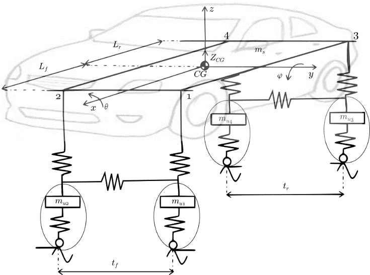

## Project specifications

The first step was to set all the signals and variables that the model would need:

  - _State variables:_
    - Cartesian positioning along all axes: $X, Y, Z$
    - Rotation along all axes: roll ($\theta$), pitch ($\phi$) and yaw ($\psi$)
  - _Input control signals:_
    - Position of the steering wheel: $\lambda$
    - Vehicle speed: $V$

  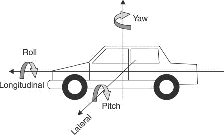

  

Some additional criteria was also specified to simplify the model:

  - The vehicle is a four tyres private car
  - The vehicle travels without any significant load
  - The model works for low velocity (urban routes)
  - The road has no slope and no bumps

With it, the final model is defined as a **combination** of different mathematical and/or physical models.

## Vehicle characterization

### Relation steering wheel and front tyres rotation

As specified before, one of the control signals is the steering wheel position (as an angle).
However, this data has to be transformed into a front tyre rotation to be used at the model.
By following the Ackerman turning model, the rotation of the tyre is greater at the inner wheel than the outer.

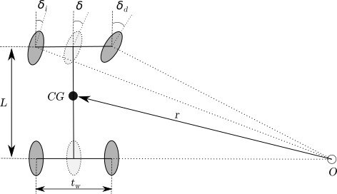

With this information, the final solution will show the ratio steering wheel / middle tyre.
The middle tyre does not exist physically, but it will be used as an approximation.
For the ratio calculation, a Citröen C4 is used as the test model for all physical measurements.
Thus, the first measurement was for the tyres rotation, obtaining the following results:

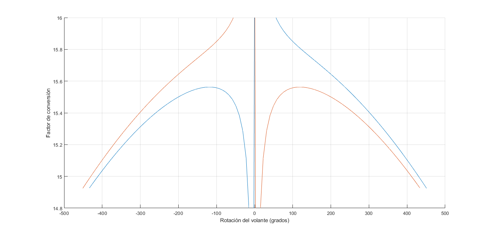

At the graph, the orange function represents the left tyre and the blue one, the right tyre.
The ratio was obtained by the second degree equation of the curve created by the mean of both, the left and right tyres, measurements.

$$
ratio = 15.75 + 2 * 10^{-16} * \lambda - 4 * 10^{-6} * \lambda^{2}
$$

By taking care of no linealities, the front middle tyre rotation ($\delta$) is defined as following:

$$
\delta = \arctan(\frac{\lambda}{ratio})
$$

### Center of Gravity (CG)

The CG is the imaginary point around which all resultant torques vanish.
Thus, by definition, the CG is positioned within the body as a function of the weight distribution.

By analyzing a vehicle; and defining the axis as X to the front, Y to the left and Z upwards; its CG is position:
  
  - Closer to the front of the vehicle at the X axis.
  - At the origin at the Y axis, because a vehicle is laterally well-balanced.
  - Close to the ground (the origin) at the axis Z but with height.

The only two coordinates that are not known are the X and Z position.
These can be found at any vehicle by realizing two weight measurements and applying trigonometry:

| First measurement | Second measurement|
| --- | --- |
|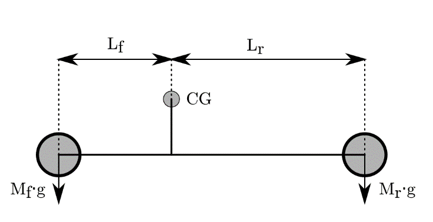 | 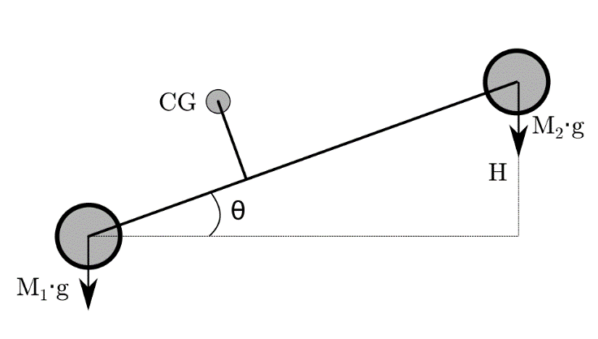|

With the **first measurement** it's known the front and rear mass ($M_{f}, M_{r}$).
Applying these terms to the equilibrium equation, the distance from CG to the front and the rear distance ($l_{f}, l_{r}$) are found, defining the CG position along the X axis.
At the next equations, $L$ represents the wheelbase of the vehicle.

$$
l_{f} = L * \frac{M_{r}}{M}
$$

$$
l_{r} = L * \frac{M_{f}}{M} = L - l_{f}
$$

With the **second measurement**, $H$ is a selected height to elevate the rear part of the vehicle.
Applying basic trigonometry, the angle represented as $\Theta$ is also known. 
Therefore, because of the new mass distribution due to the elevation, the front and rear masses ($M_{1}, M_{2}$) are different.
 Then the height of the CG is defined by the following mathematical relation:

$$
Z_{CG} = \frac{M_{1} * l_{f} - M_{2} * l_{r}}{M * \tan\Theta}
$$

With that las equation, all coordinates of the CG are known.

### Model of one-fourth vehicle: Damper model
When a vehicle is in motion, the angles of pitch and roll appear when it changes its speed and/or it takes a turn.
This effect can only exist if the mechanical properties of the vehicle allows it.
If we imagine a metal rod, the rod cannot be compressed to change its total length.
However, if we imagine a spring, it can be compressed.

A vehicle experiences this effect because it has a damper system joining each tyre to the chassis.
There are also two anti-roll rods: one joining the front tyres and one joining the rear tyres, but these will be neglected at the model.
Thus, the last part to characterize of the vehicle is the system of the dampers.

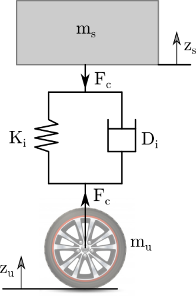

The compression force that experiences a damper ($F_{ci}$) is defined by a second order equation, in function of the chassis displacement:

$$
F_{ci} = - K_{i} (z_{s} - z_{s0}) - D_{i} (\dot z_{s} - \dot z_{s0}) + m_{si} * g
$$

At the equation, each letter represents:

  - $i$ is the number representing each corner of the vehicle, going from 1 to 4.
  - $K$ is the spring constant.
  - $D$ is the coefficient of friction of the damper.
  - $m_{s}$ is the chassis mass hold by the damper.

To model all dampers is not needed to make all calculations four times.
Both front dampers are equal and both rear dampers are equal.
Then calculations are only needed to be carried twice.

And at last, two approximations will be applied:

- The tyre doesn't deform. All the vertical displacement will be hold at the damper.
- The model of a single damper is a 1-DoF model. It only accepts vertical displacement and doesn't have any rotations.

With the previous statements and at a static state, the damper's force is equal to the weight of the chassis. 
Then the only acceleration is the gravity.
Applying it at the previous equation, the constant $K$ can be defined.
For it, the vertical displacement will be the difference of the extended spring minus the length of the spring when the vehicle is at rest on the floor. 

$$
K_{i}(z_{s} - z_{s0}) =  m_{si} * g
$$

With it, the only remaining parameter is the coefficient of friction $D$. 
To calculate it, the full equation has to be reorganized at the Laplace domain to obtain the transfer function.
For it, $Z_{s}$ is the output and $Z_{s0}$ the input.

$$
\frac{Z_{s}(s)}{Z_{s0}(s)} = \frac{D * s + K}{m_{s} * s^{2} + D * s + K}
$$

The parameters are obtained by analyzing the characteristic equation from the transfer function.
This one has to be compared to the second order equation of a damped system.

$$
s^{2} + s * \frac{D}{m_{s}} + \frac{K}{m_{s}} = s^{2} + s * 2 \xi \omega_{n} + \omega_{n}^{2}
$$

By comparing the terms all the parameters can be obtained as long as $\xi$ is defined.
The $\xi$ at a damper is not constant, taking a value among $0.7$ and $0.9$.
However, taking in consideration the final model won't travel at fast velocities and 
the road is considered in good conditions, its value will be considered constant at $0.7$.

$$
\omega_{n} = \sqrt{\frac{K}{m_{s}}}
$$

$$
D = 2 \omega_{n} m_{s} \xi
$$

For a more precise approach, a curve force-velocity should be analyzed at a test bench.
This curve characterizes the $\xi$ factor of a damper.

## Bicycle model
The simplified bicycle model aliases the trajectory of a vehicle assuming it only has one front wheel and one rear wheel.
With a 2D analysis, this model only has 3 state variables, which represent the DoF of the model, and 2 control signals:

  - State variables: $X, Y, \psi$
  - Control signals: $V, \delta$

As it can be noticed, a control signal is the rotation of the front wheel ($\delta$).
Previously has been proven how to obtain this parameter prom the steering wheel position, so from now on all equations will show only the $\delta$ parameter.

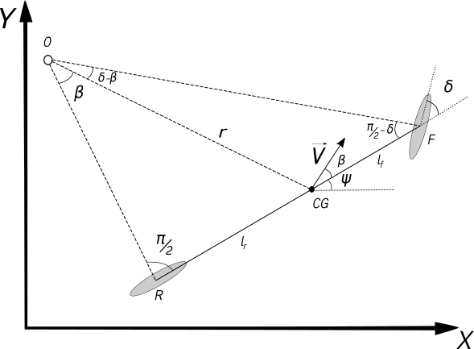

The basics of physics establish that a coefficient of friction $\mu$ is needed, between the tyres and the road, for the vehicle being able to travel.
An infinite $\mu$ would mean a perfect adhesion of the vehicle to the ground, resulting in a perfect trajectory when turning.
At the contrary, a $\mu$ with a very low value would mean to the vehicle to slip.
A clear example of the vehicle slipping is driving on ice.

The difference of the ideal track and the real one is defined the slip angle ($\beta$).

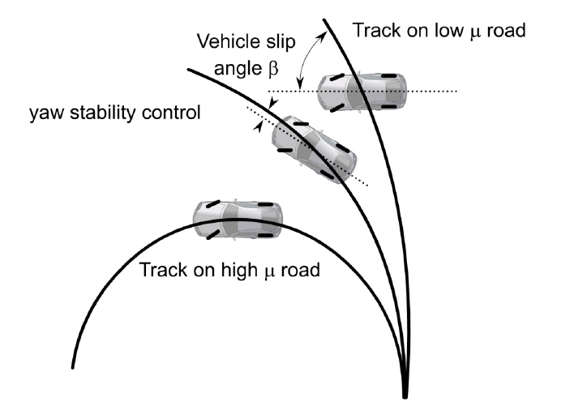

With the $\beta$ the instantaneous trajectory ($\gamma$) is defined as the sum of the yaw and the slip angle.

$$
\gamma = \psi + \beta
$$

However, $\gamma$ doesn't show he real evolution of the track.
Therefore, a further analysis is needed to find the derivate of the state variables.
This is done by applying trigonometry to the bicycle diagram to know $\beta$.

$$
\beta = \arctan(l_{r} * \frac{\tan\delta}{L})
$$

By knowing $\beta$ it is known $\gamma$ and the differences at velocity for each of the state variables.

$$
\frac{dX}{dt} = V * cos(\psi + \beta)
$$

$$
\frac{dY}{dt} = V * sin(\psi + \beta)
$$

$$
\frac{d\psi}{dt} = V * \frac{sin\beta}{l_{r}}
$$

## Cinematic models
### Roll approximation
Masato Abe and W. Manning present a way to determine the steady state value of the roll of a moving vehicle,
documented at their book _Vehicle Handling Dynamics_.
For it, they announce only certain parameters are needed:

  - The mass of the chassis ($m_{s}$)
  - The distance from the CG to the roll axis ($d_{roll}$)
  - The anti-roll constant ($K_{\theta}$), being composed by all four dampers and the anti-roll bars.

With these parameters, they establish the roll is a function of the lateral acceleration ($a_{y}$).

$$
\theta = f(a_{y}) = a_{y} * \frac{m_{s} * d_{roll}}{K_{\theta}}
$$

With the previous statement of the vehicle travelling at low speed, 
the approximation of calculating the roll with the steady state value could be a correct approximation.

### Pitch approximation
Based on the theory of Masato Abe and W. Manning, a steady state pitch approximation model was developed.
It has the same bases as the previous model, but adapted to the pitch angle.

$$
\phi = f(a_{x}) = a_{x} * \frac{m_{s} * d_{pitch}}{K_{\phi}}
$$

## Dynamic model for pitch and roll
This model was based on the studies made by Chalmers' University. 
Here, a physical model was detailed and analyzed by semi-vehicle models to calculate the force momentum.
These half-models combined create a full vehicle model that predicts the increment in acceleration for the pitch and roll angles.

### Pitch-model
To calculate how the pitch evolves, a side-vehicle model has to be analyzed. 
Within it, the vehicle rotates around a Pitch Center point ($PC$), which is not at the same position as the CG.

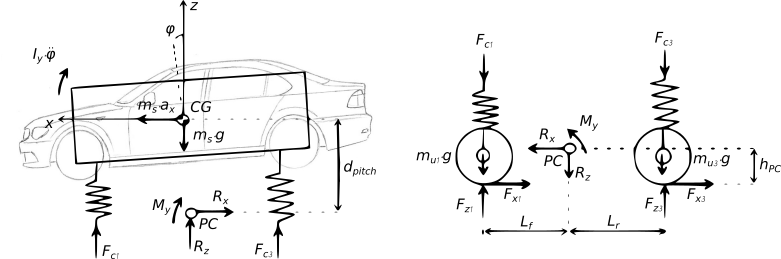

As it can be seen at the image, the analysis is carried out by comparing the equations for $M_{y}$ resultant of the top and the bottom forces.
By doing so, the following is the equation for a side-car, at this case, the left side of the vehicle.
At it is also taking the approximation of $\tan(\alpha) \approx \alpha$ for very small angles.

$$
\begin{align}
(I_{y} + m_{s} * d_{pitch}^{2}) &* \frac{d^{2}\phi}{dt^{2}} = \\
&(F_{x1} + F_{x3}) * h_{PC} - F_{c1} * l_{f} + F_{c3} * l_{r} \\
&+ m_{s} * a_{x} * d_{pitch} + m_{s} * g * d_{pitch} * \phi
\end{align}
$$

With that analysis it is obtained the equation for half vehicle. 
The advantage for the pitch, as mentioned when the CG's position was being defined, is that the vehicle is symmetric at that axis.
For it, the full equation, considering both sides of the vehicle, is the following:

$$
\begin{align}
(I_{y} + m_{s} * d_{pitch}^{2}) &* \frac{d^{2}\phi}{dt^{2}} = \\
&\alpha \sum F_{x} * h_{PC} - (F_{c1} + F_{c2}) * l_{f} + (F_{c3} + F_{c4}) * l_{r} \\
&+ m_{s} * a_{x} * d_{pitch} + m_{s} * g * d_{pitch} * \phi
\end{align}
$$

### Roll-model
The definition of the roll-model follows the same guidelines as the pitch model.
However, the vehicle does not have the same symmetrical properties for the front and the back.
This affects to:
  - The front and rear mass 
  - The dampers characteristics
  - The distance to the Roll Center (RC), due its axis is tilted and not parallel to the ground

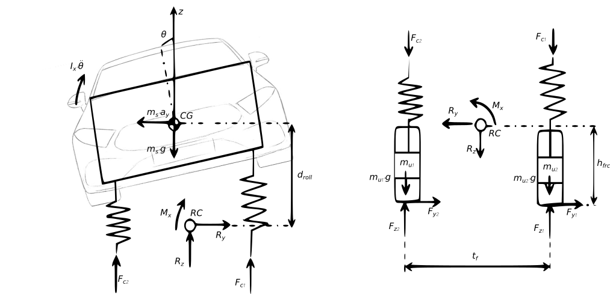

To simplify the calculus, the only approximation to be made is to consider that RC is in fact at the same distance.
In other words, it will be supposed that the axis that holds RC is parallel to the ground.
With it and following the previous analysis steps, the equation for the variation of the roll can be obtained as:

$$
\begin{align}
(I_{x} + m_{s} * d_{roll}^{2}) &* \frac{d^{2}\theta}{dt^{2}} = \\
&\alpha \sum F_{y} * h_{RC} + (F_{c1} - F_{c2}) * \frac{t_{f}}{2} + (F_{c3} - F_{c4}) * \frac{t_{r}}{2} \\
&+ m_{s} * a_{y} * d_{roll} + m_{s} * g * d_{roll} * \theta
\end{align}
$$
